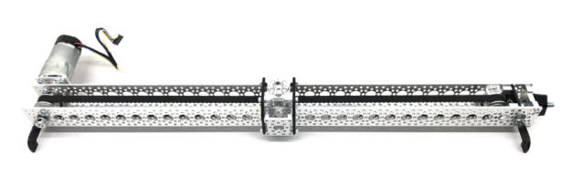

## Description of the project

As part of the project, we have designed and implemented complete linear
guide controller, with the following functionalities:
 

1. DC motor control using the H bridge  
2. Operation of an incremental encoder located on the motor axis 
3. Calculation of motor position and speed based on data taken from the encoder 
4. Implementation of the PID controller using the ARM CMSIS DSP library 
5. Tuning the PID controller 
6. Implementation of head positioning using the limit switch 
7. Emergency stop of the head in extreme positions with the use of limit switches 
8. Implementation of parent application with USB communication 
9. Design and implementation of the graphical user interface 

## Hardware specification

This slider has an overall length of 24” with a usable 19” of
slide travel. The slider is equipped with aPololu gear motor.
The gearmotor is a powerful 12V brushed DC motor with a 131.25:1 metal gearbox
and an integrated quadrature encoder that provides a resolution of 64 counts per
revolution of the motor shaft, which corresponds to 8400 counts per revolution of the
gearbox’s output shaft.  
 A two-channel Hall effect encoder is used to sense the
rotation of a magnetic disk on a rear protrusion of the motor shaft. The Quadrature
encoder provides a resolution of 64 counts per revolution of the motor shaft when
counting both edges of both channels. To compute the counts per revolution of the
gearbox output, multiply the gear ratio by 64. The motor/encoder has six
color-coded, 20 cm leads.